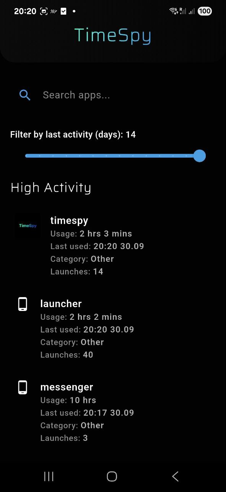
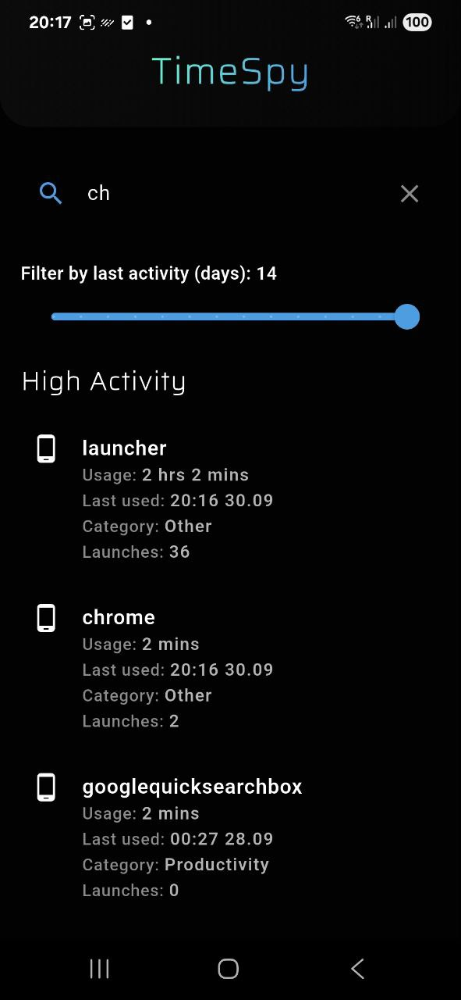
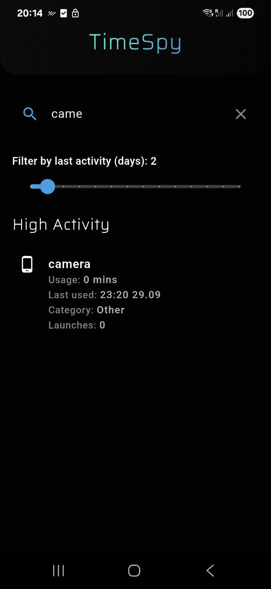

### TimeSpy

Android app that helps you monitor which apps you use, how often and for how long.  
It gives you insights into your daily app habits - all locally, without any trackers or analytics.


### Features

- View recent app activity (foreground events)
- See launch counts per app (Android 10+ / API 29+)
- Categorize apps (e.g., Social, Games, Productivity)
- Works entirely offline
- **No trackers, no network connections**

<table>
  <tr>
    <td>
      
    </td>
    <td>
      
    </td>
    <td>
      
    </td>
  </tr>
</table>


### Privacy

TimeSpy **does not send any data to the internet**.  
All processing happens **locally on your device**.

The app uses standard Android APIs:
- `PACKAGE_USAGE_STATS` - for collecting usage history
- Native Kotlin integration via Flutter MethodChannel


### Permissions Required

To function correctly, the app needs **Usage Access permission**.

You can enable it manually:

> Settings → Security → Usage Access → TimeSpy → Allow

Or tap the in-app button to be redirected.


### Download 

The official release build, signed and ready for use

1. Open **F-Droid**
2. Go to:
   > Settings → Repositories → Add
3. Paste the URL:
   > https://Alpaca00.github.io/timespy-fdroid-repo/
4. TimeSpy will appear after repo sync.


### Building from Source

#### Requirements:
- Flutter SDK
- Android SDK (API 34+)
- NDK (optional)

#### Build command:

```bash
flutter pub get
flutter build apk --debug